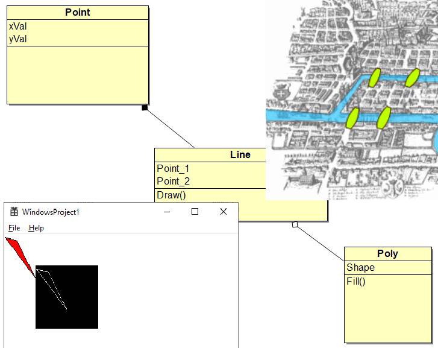
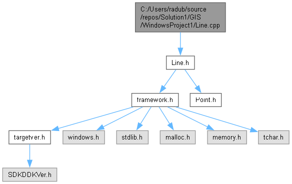
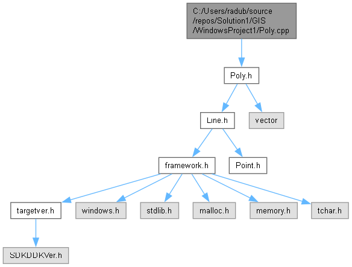

# GIS



### AUTHORS: radubm1, ionnarcis.dorobat
### Version  1.0


## Table of contents

### Class Index
#### Class List
Here are the classes, structs, unions and interfaces with brief descriptions:
Line  	pagenum
Point  	pagenum
Poly  	pagenum


### File Index
#### File List
Here is a list of all files with brief descriptions:
C:/Users/radub/source/repos/Solution1/GIS/WindowsProject1/framework.h  	pagenum
C:/Users/radub/source/repos/Solution1/GIS/WindowsProject1/Line.cpp  	pagenum
C:/Users/radub/source/repos/Solution1/GIS/WindowsProject1/Line.h  	pagenum
C:/Users/radub/source/repos/Solution1/GIS/WindowsProject1/Point.cpp  	pagenum
C:/Users/radub/source/repos/Solution1/GIS/WindowsProject1/Point.h  	pagenum
C:/Users/radub/source/repos/Solution1/GIS/WindowsProject1/Poly.cpp  	pagenum
C:/Users/radub/source/repos/Solution1/GIS/WindowsProject1/Poly.h  	pagenum
C:/Users/radub/source/repos/Solution1/GIS/WindowsProject1/Resource.h  	pagenum
C:/Users/radub/source/repos/Solution1/GIS/WindowsProject1/targetver.h  	pagenum
C:/Users/radub/source/repos/Solution1/GIS/WindowsProject1/WindowsProject1.cpp  	pagenum
C:/Users/radub/source/repos/Solution1/GIS/WindowsProject1/WindowsProject1.h  	pagenum


### Class Documentation
#### Line Class Reference
```
#include <Line.h>
```
Public Member Functions
```
Line (Point _p1, Point _p2)
void Draw (HDC memDC)
```
Constructor & Destructor Documentation
```
Line::Line (Point  _p1, Point  _p2)
```
Member Function Documentation
```
void Line::Draw (HDC  memDC)
```
The documentation for this class was generated from the following files:
0.	C:/Users/radub/source/repos/Solution1/GIS/WindowsProject1/Line.h
1.	C:/Users/radub/source/repos/Solution1/GIS/WindowsProject1/Line.cpp

#### Point Class Reference
```
#include <Point.h>
```
Public Member Functions
```
Point (int _x, int _y)

Point ()

int getX ()

int getY ()
```

Constructor & Destructor Documentation
```
Point::Point (int  _x, int  _y)
Point::Point ()
```
Member Function Documentation
```
int Point::getX ()
int Point::getY ()
```
The documentation for this class was generated from the following files:
0.	C:/Users/radub/source/repos/Solution1/GIS/WindowsProject1/Point.h
1.	C:/Users/radub/source/repos/Solution1/GIS/WindowsProject1/Point.cpp
#### Poly Class Reference
```
#include <Poly.h>
```
Public Member Functions
```
void Fill ()
```
Member Function Documentation
```
void Poly::Fill ()
```
The documentation for this class was generated from the following files:
0.	C:/Users/radub/source/repos/Solution1/GIS/WindowsProject1/Poly.h
1.	C:/Users/radub/source/repos/Solution1/GIS/WindowsProject1/Poly.cpp

#### File Documentation
C:/Users/radub/source/repos/Solution1/GIS/WindowsProject1/framework.h File Reference
```
#include "targetver.h"
#include <windows.h>
#include <stdlib.h>
#include <malloc.h>
#include <memory.h>
#include <tchar.h>
```
Include dependency graph for framework.h:
IMAGE

This graph shows which files directly or indirectly include this file:
IMAGE

Macros
```
#define WIN32_LEAN_AND_MEAN
```
Macro Definition Documentation
```
#define WIN32_LEAN_AND_MEAN
framework.h
```
Go to the documentation of this file.
```
1 // header.h : include file for standard system include files,
2 // or project specific include files
3 //
4 
5 #pragma once
6 
7 #include "targetver.h"
8 #define WIN32_LEAN_AND_MEAN             // Exclude rarely-used stuff from Windows headers
9 // Windows Header Files
10 #include <windows.h>
11 // C RunTime Header Files
12 #include <stdlib.h>
13 #include <malloc.h>
14 #include <memory.h>
15 #include <tchar.h>
```
C:/Users/radub/source/repos/Solution1/GIS/WindowsProject1/Line.cpp File Reference
```
#include "Line.h"
```
Include dependency graph for Line.cpp:

C:/Users/radub/source/repos/Solution1/GIS/WindowsProject1/Line.h File Reference
```
#include "framework.h"
#include "Point.h"
```
Include dependency graph for Line.h:
IMAGE

This graph shows which files directly or indirectly include this file:
IMAGE

#### Classes

class Line

Line.h
Go to the documentation of this file.
```
1 #ifndef _LINE_H
2 #define _LINE_H
3 #include "framework.h"
4 #include "Point.h"
5 
6 class Line {
7   private:
8     Point p1;
9     Point p2;
10 
11   public:
12       Line(Point _p1, Point _p2);
13       void Draw(HDC memDC);
14 
15 };
16 #endif
```
C:/Users/radub/source/repos/Solution1/GIS/WindowsProject1/Point.cpp File Reference
```
#include "Point.h"
```
Include dependency graph for Point.cpp:
IMAGE

C:/Users/radub/source/repos/Solution1/GIS/WindowsProject1/Point.h File Reference
This graph shows which files directly or indirectly include this file:
IMAGE
Classes

class Point

Point.h
Go to the documentation of this file.
```
1 #ifndef _POINT_H
2 #define _POINT_H
3 
4 
5 class Point {
6   private:
7     int xVal;
8     int yVal;
9 
10 public:
11     Point(int _x, int _y);
12     Point();
13     int getX();
14     int getY();
15 
16 };
17 #endif
```

C:/Users/radub/source/repos/Solution1/GIS/WindowsProject1/Poly.cpp File Reference
```
#include "Poly.h"
```
Include dependency graph for Poly.cpp:


C:/Users/radub/source/repos/Solution1/GIS/WindowsProject1/Poly.h File Reference
```
#include "Line.h"
#include <vector>
```
Include dependency graph for Poly.h:
IMAGE

This graph shows which files directly or indirectly include this file:
IMAGE

Classes
class Poly

Poly.h
Go to the documentation of this file.
```
1 #ifndef _POLY_H
2 #define _POLY_H
3 
4 
5 #include "Line.h"
6 #include <vector>
7 
8 class Poly {
9   private:
10     std::vector<Line> Shape;
11 
12 
13   public:
14     void Fill();
15 
16 };
17 #endif
```

C:/Users/radub/source/repos/Solution1/GIS/WindowsProject1/WindowsProject1.cpp File Reference
```
#include "framework.h"
#include "WindowsProject1.h"
#include "point.h"
#include "line.h"
```
Include dependency graph for WindowsProject1.cpp:
IMAGE
Macros
0.	#define MAX_LOADSTRING  100
Functions
0.	ATOM MyRegisterClass (HINSTANCE hInstance)
1.	BOOL InitInstance (HINSTANCE, int)
2.	LRESULT CALLBACK WndProc (HWND, UINT, WPARAM, LPARAM)
3.	INT_PTR CALLBACK About (HWND, UINT, WPARAM, LPARAM)
4.	int APIENTRY wWinMain (_In_ HINSTANCE hInstance, _In_opt_ HINSTANCE hPrevInstance, _In_ LPWSTR lpCmdLine, _In_ int nCmdShow)
Variables
0.	HINSTANCE hInst
1.	WCHAR szTitle [MAX_LOADSTRING]
2.	WCHAR szWindowClass [MAX_LOADSTRING]
3.	const int WIDTH = 100
4.	const int HEIGHT = 100

Macro Definition Documentation
```
#define MAX_LOADSTRING  100
```
Function Documentation
```
INT_PTR CALLBACK About (HWND  hDlg, UINT  message, WPARAM  wParam, LPARAM  lParam)
BOOL InitInstance (HINSTANCE  hInstance, int  nCmdShow)
ATOM MyRegisterClass (HINSTANCE  hInstance)
LRESULT CALLBACK WndProc (HWND  hWnd, UINT  message, WPARAM  wParam, LPARAM  lParam)
Hint APIENTRY wWinMain (_In_ HINSTANCE  hInstance, _In_opt_ HINSTANCE  hPrevInstance, _In_ LPWSTR  lpCmdLine, _In_ int  nCmdShow)
```
Variable Documentation
```
const int HEIGHT = 100
HINSTANCE hInst
WCHAR szTitle[MAX_LOADSTRING]
WCHAR szWindowClass[MAX_LOADSTRING]
const int WIDTH = 100
```
C:/Users/radub/source/repos/Solution1/GIS/WindowsProject1/WindowsProject1.h File Reference
```
#include "resource.h"
```
Include dependency graph for WindowsProject1.h:
IMAGE

This graph shows which files directly or indirectly include this file:
IMAGE
```
WindowsProject1.h
```
Go to the documentation of this file.
```
1 #pragma once
2 
3 #include "resource.h"
```
